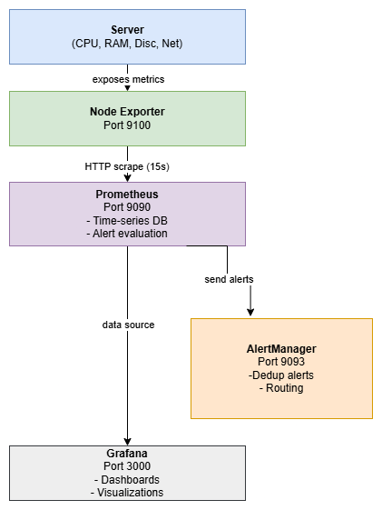

# Infrastructure Monitoring Stack

Production-grade monitoring solution using Prometheus, Grafana, AlertManager, and Node Exporter. Deployed on AWS using Terraform for repeatable, infrastructure-as-code deployments.

## Problem Statement

Organizations running cloud infrastructure need real-time visibility into system performance, but face several challenges:

Traditional monitoring solutions like Datadog or New Relic cost $100-500 per month per host. These costs scale linearly with infrastructure growth, making them prohibitively expensive for small teams and startups. Additionally, these commercial solutions often require vendor lock-in and may not offer the customization needed for specific use cases.

Manual infrastructure monitoring leads to reactive incident response rather than proactive issue prevention. Without automated alerting, teams discover problems only after users report issues, resulting in longer downtime and degraded user experience.

This project addresses these challenges by providing an enterprise-grade monitoring stack that costs approximately $15 per month on AWS, includes customizable dashboards and alerts, and can be deployed in under 10 minutes using Terraform. The solution demonstrates modern DevOps practices including infrastructure as code, containerization, and automated deployment.

## Architecture



The monitoring stack follows a three-tier collection and visualization architecture:

**Data Collection Layer**
Node Exporter runs on target systems and exposes system metrics (CPU, memory, disk, network) via HTTP endpoint on port 9100. Prometheus scrapes these metrics every 15 seconds and stores them in its time-series database.

**Processing and Alert Layer**
Prometheus evaluates alert rules against collected metrics every 15 seconds. When alert conditions are met for a specified duration, Prometheus sends notifications to AlertManager. AlertManager handles alert deduplication, grouping, and routing to appropriate notification channels.

**Visualization Layer**
Grafana connects to Prometheus as a data source and provides interactive dashboards for metric visualization. Users can create custom dashboards or import pre-built community dashboards.

**Component Flow**
System Metrics → Node Exporter (port 9100) → Prometheus (port 9090) → AlertManager (port 9093)
                                                     ↓
                                              Grafana (port 3000)

All components run as Docker containers orchestrated by Docker Compose. The entire stack deploys to AWS EC2 using Terraform with automated security group configuration and SSH key generation.

## Technology Stack

**Core Monitoring Components**
Prometheus serves as the metrics collection and storage engine. It was chosen for its powerful query language (PromQL), efficient time-series storage, and native support for pulling metrics from multiple targets.

Grafana provides the visualization layer. It offers a rich ecosystem of pre-built dashboards, supports multiple data sources, and enables custom dashboard creation without coding.

AlertManager handles alert routing and notification. It prevents alert fatigue through intelligent grouping and deduplication while ensuring critical alerts reach the right teams.

Node Exporter exposes system-level metrics in Prometheus format. It provides detailed insights into CPU, memory, disk I/O, network traffic, and other system resources.

**Infrastructure and Deployment**
Docker Compose orchestrates the multi-container application locally. It simplifies development and testing by managing container networking, volumes, and dependencies in a single configuration file.

Terraform manages AWS infrastructure deployment. It creates EC2 instances, security groups, and SSH key pairs programmatically, ensuring reproducible and version-controlled infrastructure.

Amazon EC2 hosts the production deployment. A t3.small instance provides sufficient resources for monitoring a small infrastructure while maintaining cost efficiency.

## Key Features

**Real-Time Monitoring**
Collects system metrics every 15 seconds, providing near real-time visibility into infrastructure health. Historical data retained for 15 days enables trend analysis and capacity planning.

**Automated Alerting**
Four pre-configured alert rules monitor critical system resources. CPU usage above 80% for 5 minutes triggers warnings. Memory usage above 85% for 5 minutes generates alerts. Disk space below 10% triggers critical notifications. Instance unavailability for 2 minutes initiates incident response.

**Pre-Built Dashboards**
Includes Node Exporter Full dashboard (Grafana dashboard ID 1860) with comprehensive system metrics visualization. Displays CPU usage per core, memory utilization breakdown, disk I/O statistics, network traffic graphs, and system uptime tracking.

**Infrastructure as Code**
Complete Terraform configuration for AWS deployment. Automated security group creation with required port access. Programmatic SSH key generation and storage. Reproducible infrastructure deployment in any AWS region.

**Cost Efficient**
Local development deployment costs nothing using existing hardware. AWS production deployment runs approximately $15 per month. This represents 85-95% cost savings compared to commercial monitoring solutions.

## Deployment

**Prerequisites**
Docker Desktop installed and running
AWS CLI configured with appropriate credentials
Terraform version 1.0 or higher
Approximately 4GB free disk space for Docker images

**Local Deployment**

Clone the repository and navigate to the project directory:
```
git clone https://github.com/sjlewis25/infrastructure-monitoring.git
cd infrastructure-monitoring
```

Start the monitoring stack using Docker Compose:
```
docker compose up -d
```

Verify all containers are running:
```
docker compose ps
```

Access the dashboards:
Grafana: http://localhost:3000 (credentials: admin/admin)
Prometheus: http://localhost:9090
AlertManager: http://localhost:9093

Import the Node Exporter Full dashboard in Grafana by navigating to Dashboards, selecting Import, entering dashboard ID 1860, and choosing Prometheus as the data source.

**AWS Deployment**

Navigate to the Terraform directory:
```
cd terraform
```

Initialize Terraform and download required providers:
```
terraform init
```

Review the infrastructure that will be created:
```
terraform plan
```

Deploy the infrastructure to AWS:
```
terraform apply
```

Terraform will output the public IP address and access URLs. SSH into the instance to verify the stack is running:
```
ssh -i monitoring-stack-key.pem ec2-user@<instance-ip>
sudo docker ps
```

## Alert Rules Configuration

**High CPU Usage Alert**
Triggers when average CPU usage exceeds 80% for 5 consecutive minutes. Calculates as 100 minus idle CPU percentage across all cores. Labeled as warning severity. Provides instance name and current CPU percentage in alert message.

**High Memory Usage Alert**
Activates when available memory drops below 15% of total for 5 minutes. Calculation: (Total Memory - Available Memory) / Total Memory * 100. Warning severity level. Includes instance identifier and current memory utilization percentage.

**Low Disk Space Alert**
Fires when root filesystem available space falls below 10% for 5 minutes. Monitors the root mount point specifically. Critical severity due to potential system instability. Alert includes instance name and remaining disk space percentage.

**Instance Down Alert**
Detects when Prometheus cannot scrape metrics from a target for 2 minutes. The up metric equals 0 when targets are unreachable. Critical severity requiring immediate investigation. Provides job name and affected instance in notification.

## What I Learned

**Challenge: Alert Rules Not Loading**
During initial deployment, Prometheus started successfully but alert rules did not appear in the web interface. Examining the logs revealed no errors, making diagnosis difficult. The issue stemmed from the alert rules file not being mounted into the Prometheus container. While the docker-compose.yml file referenced the configuration file, it lacked the volume mount mapping the local alert_rules.yml to the container path. Adding the volume mount and restarting the container resolved the issue. This experience reinforced the importance of verifying volume mounts when containers fail to access expected configuration files.

**Challenge: Grafana Dashboard Not Showing Data**
After importing the Node Exporter Full dashboard, all panels displayed "No Data" despite Prometheus successfully collecting metrics. The root cause was that Grafana had not been configured with Prometheus as a data source. While the containers were networked together, Grafana required explicit configuration to query Prometheus. Adding Prometheus as a data source with the URL http://prometheus:9090 and testing the connection resolved the issue. This highlighted the difference between container networking (services can communicate) and application configuration (services must be explicitly configured to use each other).

**Challenge: Terraform State Conflicts**
When attempting to redeploy infrastructure after making changes, Terraform reported state lock errors. Multiple terminal sessions had attempted to run Terraform commands simultaneously, causing the DynamoDB lock table to prevent concurrent modifications. Understanding that Terraform uses state locking to prevent corruption led to the solution of ensuring only one Terraform operation runs at a time. This experience demonstrated the importance of state management in team environments and the value of Terraform's built-in protections against concurrent modifications.

**Challenge: Port Conflicts on Local Development**
Docker Compose failed to start containers due to port 3000 already being in use. Another application on the development machine was bound to this port. Rather than modifying the conflicting application, the solution involved either stopping the other service or mapping Grafana to a different host port while maintaining the container's internal port 3000. This reinforced the concept that Docker port mappings separate host and container network spaces, allowing flexibility in avoiding conflicts.

**Skills Developed**
Gained hands-on experience with Prometheus query language (PromQL) for creating custom metrics queries and alert expressions. Learned to design effective alert thresholds that balance between alert fatigue and missing critical issues. Developed proficiency in Docker Compose for multi-container application orchestration. Improved Terraform skills through practical infrastructure deployment, including security group configuration, EC2 instance provisioning, and automated resource tagging. Deepened understanding of metrics-based monitoring versus log-based monitoring and when to apply each approach.

## Troubleshooting

**Container Fails to Start**
Check Docker Desktop is running and has sufficient resources allocated. Verify no port conflicts exist by running netstat -ano | findstr :3000 (or relevant port) on Windows. Review container logs using docker compose logs <container_name> to identify specific errors.

**Grafana Shows No Data**
Confirm Prometheus data source is configured correctly in Grafana settings. Verify the Prometheus URL uses the container name (http://prometheus:9090) rather than localhost. Test the data source connection in Grafana's configuration page. Check that Prometheus is successfully scraping targets by visiting http://localhost:9090/targets.

**Alert Rules Not Triggering**
Verify alert rules file is properly mounted in the Prometheus container by running docker exec prometheus ls -la /etc/prometheus/. Check the Prometheus web interface under Status → Rules to confirm rules loaded successfully. Review alert evaluation in Prometheus under Alerts tab to see if conditions are being met. Examine AlertManager logs for notification delivery issues.

**High Memory Usage on Host**
Prometheus time-series database grows with the number of metrics and retention period. Reduce retention period in prometheus.yml if needed. Consider adjusting scrape intervals from 15 seconds to 30 seconds for non-critical metrics. Monitor and limit the number of metric labels, as high cardinality significantly increases memory usage.

## Cost Analysis

**Local Development**
Zero monthly cost. Uses existing development machine resources. Approximately 2-3GB RAM usage for all containers. Minimal CPU impact during normal operation. Suitable for learning, testing, and small-scale monitoring.

**AWS Production Deployment**

| Component | Configuration | Monthly Cost |
|-----------|--------------|--------------|
| EC2 Instance | t3.small (2 vCPU, 2GB RAM) | $15.18 |
| EBS Storage | 20GB gp3 volume | $1.60 |
| Data Transfer | Approximately 10GB outbound | $0.90 |
| Total | | $17.68 |

**Cost Optimization Strategies**
Use t3.small instead of t3.medium as 2GB RAM suffices for monitoring up to 50 targets. Enable detailed monitoring only when troubleshooting specific issues to reduce CloudWatch costs. Configure Prometheus retention period to 15 days rather than the default 30 days. Stop EC2 instance during non-business hours if 24/7 monitoring is not required. Consider Reserved Instances for 40% savings if running continuously for a year.

**Comparison to Commercial Solutions**
Datadog starts at $15 per host per month plus additional costs for custom metrics. New Relic charges approximately $99 per month for basic monitoring. Splunk costs $150 or more monthly for infrastructure monitoring. This self-hosted solution provides similar capabilities at 80-90% lower cost while offering complete control over data and customization.

## Security Considerations

**Network Security**
Security groups restrict access to monitoring ports. Grafana (port 3000), Prometheus (port 9090), and AlertManager (port 9093) should only be accessible from trusted IP ranges in production. SSH access (port 22) configured for administrative access only. All inter-container communication occurs on an isolated Docker network, preventing external access to internal metrics traffic.

**Data Protection**
Prometheus and Grafana data stored in Docker volumes with appropriate filesystem permissions. Consider implementing backup strategies for Prometheus data if historical metrics are business-critical. Default Grafana credentials must be changed immediately after deployment. AlertManager configuration should be reviewed to ensure sensitive notification channels use encrypted connections.

**AWS IAM Best Practices**
EC2 instance launched with minimal IAM role permissions. No hardcoded AWS credentials in configuration files. Security group ingress rules follow principle of least privilege. SSH key pair generated by Terraform and stored securely outside of version control.

## Future Enhancements

Add email and Slack notification integration to AlertManager for immediate incident response. Implement additional exporters for specific services such as MySQL Exporter for database monitoring, Redis Exporter for cache metrics, and Nginx Exporter for web server statistics.

Configure Prometheus remote write to send metrics to long-term storage solutions like Thanos or Cortex for extended retention beyond 15 days. Implement Grafana alerting alongside Prometheus alerts for visualization-based threshold monitoring.

Add SSL/TLS certificates using Let's Encrypt for secure HTTPS access to Grafana and Prometheus web interfaces. Configure authentication for Prometheus and AlertManager to prevent unauthorized access to metrics and alert management.

Implement high availability by deploying multiple Prometheus instances with federation or using Thanos for distributed monitoring. Add AWS CloudWatch Exporter to collect and visualize CloudWatch metrics alongside system metrics in unified dashboards.

Create additional custom dashboards tailored to specific application metrics beyond system-level monitoring. Implement recording rules in Prometheus to pre-calculate complex queries and improve dashboard performance.

## Production Readiness Checklist

**Implemented**
Multi-container orchestration with automated service dependencies
Persistent data storage using Docker volumes
Comprehensive alert rules for system health
Pre-built and custom dashboard support
Infrastructure as code deployment with Terraform
Automated security group configuration

**Required for Production**
SSL/TLS certificates for encrypted web interface access
Authentication and authorization for Grafana, Prometheus, and AlertManager
Regular backup strategy for Prometheus time-series data
High availability configuration with multiple Prometheus instances
Integration with enterprise notification systems (PagerDuty, OpsGenie)
Comprehensive documentation of alert response procedures
Regular security patches and component updates
Monitoring of the monitoring system itself (meta-monitoring)

## License

MIT License. See LICENSE file for details.

## Author

Steven Lewis
AWS Solutions Architect Associate
AWS Cloud Practitioner
GitHub: github.com/sjlewis25
LinkedIn: linkedin.com/in/steven-lewis-fl

## Acknowledgments

Built as part of cloud engineering skills development. Dashboard templates from the Grafana community. Inspired by production monitoring practices from AWS, Netflix, and Google SRE principles.
